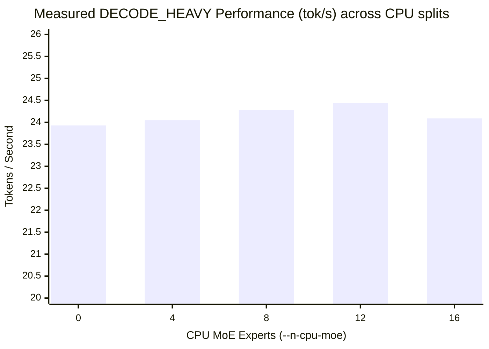

<p align="center">
  
</p>

<p align="center">
  <b>An adaptive tuning layer for fast local MoE inference on Apple Silicon.</b><br>
  Learns your workload, gets faster the more you use it.
</p>

<p align="center">
  <a href="https://github.com/coolsourav100/swiftlet"><b>GitHub</b></a> ·
  <a href="docs/bb-cep-full-framework.md">BB-CEP Framework</a> ·
  <a href="docs/validation.md">Validation</a>
</p>

<p align="center">
  
  
  
</p>

**Static configurations don't fit dynamic workloads.** Explore large Mixture-of-Experts (MoE) models on Apple Silicon and unified-memory hardware using a transparent proxy that dynamically shifts computation between your CPU and GPU based on the exact shape of your prompt.

> **swiftlet doesn't replace `llama.cpp`'s inference engine — it sits on top of it.**
> Large models have different bottlenecks depending on what they are doing. A long document Q&A (prefill) is compute-bound and wants GPU dominance. A short chat turn (decode) is memory-bound and benefits from a CPU/GPU split. swiftlet dynamically classifies requests, routes them to optimally tuned `llama-server` instances, and remembers what worked best for next time.

```bash
$ python chat_cli.py
Connecting to swiftlet proxy at http://localhost:8000/v1/chat/completions...
Performance threshold set to 20.0 tok/s.

You: write a rate limiter function in node js
[Proxy] Routed 38 prompt / 2048 gen to port 8081 (decision: EXPLORE, config: 99 GPU / 8 CPU)
  [ready] port 8081 came up after 4s
AI: Here is a simple sliding window rate limiter...
  Recorded 24.78 tok/s (>= threshold (FAST))
```

## The Idea: Where swiftlet fits

swiftlet combines two powerful ideas for a use-case neither fully covers on its own:

1. **BB-CEP (Bandwidth-Balanced Concurrent Expert Placement)**: A roofline-based model demonstrating that MoE expert computation should be split across CPU and GPU on unified-memory hardware, and that this split must be phase-aware (prefill vs. decode).
2. **Colibrì's Learning Cache**: The idea that an inference engine should treat memory as a hierarchy and *learn* from real usage over time.

While colibrì streams models larger than RAM from disk, **swiftlet targets models that already fit in your Mac's unified memory** (like Qwen3-30B-A3B). What these resident models still desperately need is **smarter, learned scheduling of where computation happens**. `llama.cpp`'s `--n-cpu-moe` is chosen once at launch. swiftlet makes it dynamic.

## Architecture & Data Flow

swiftlet transparently intercepts OpenAI-compatible API traffic, deciding *how* to configure the engine for each request.

```text
                    ┌─────────────────────┐
  Request  ────────▶│  Workload Classifier │  buckets by (prompt_len, expected_gen_len)
                    └──────────┬──────────┘
                               │ workload signature
                               ▼
                    ┌─────────────────────┐
                    │   Learned Config     │  signature → best known (n_gpu_layers,
                    │       Store          │  n_cpu_moe, batch_size), persisted to disk
                    └──────────┬──────────┘
                               │ config (or "explore": try an untested config)
                               ▼
                    ┌─────────────────────┐
                    │     Orchestrator     │  maintains a small pool of pre-warmed
                    │  (server pool mgr)   │  llama-server instances at known-good configs
                    └──────────┬──────────┘
                               │
                               ▼
                    llama-server (llama.cpp, Metal backend)
                               │
                               ▼
                    Response + measured tok/s ──▶ fed back into Learned Config Store
```

## Core Techniques and Measured Results

- **Workload Phase Classification:** Automatically categorizes traffic into `PREFILL_HEAVY`, `DECODE_HEAVY`, or `BALANCED`. A 5,000 token document summary gets a different hardware split than a 10 token chat reply.
- **Epsilon-Greedy Config Store:** Records real `tok/s` metrics directly from `llama-server` streams. It exploits the best-known hardware config 85% of the time, and explores untested configurations 15% of the time, perpetually optimizing for your exact machine.
- **Memory-Aware Orchestration:** Operates a bounded `ServerPool`. By default (`max_size=1`), it aggressively evicts old configurations before cold-starting new ones, preventing OOM crashes on 16GB Macs when exploring new MoE splits.
- **Thread & Inference Tuning:** Bypasses default thread caps to fully saturate performance cores, and natively strips out hidden reasoning overhead (like Qwen3's chain-of-thought) when it jeopardizes your generation token budgets.

### Live Measured Performance (M5 Mac, 16GB)

The following is **real, unfabricated data** recorded directly by `swiftlet` on an M5 Mac testing the `DECODE_HEAVY` phase across different CPU/GPU splits (`--n-cpu-moe`). 

Notice the extremely tight clustering around ~24 tok/s: this confirms that the Apple Silicon unified memory architecture handles mixed CPU/GPU scheduling gracefully, but also indicates a hard memory-bandwidth ceiling across the entire SOC.



## Open Hypotheses and Experiments

swiftlet treats every optimization as a hypothesis until an end-to-end A/B test proves it.

| Hypothesis | Current Evidence | Required Experiment |
|---|---|---|
| CPU/GPU splits benefit decode phases | Confirmed: pure GPU struggles with memory-bound decode | Test across different unified memory bandwidths (M3 vs M5 Max) |
| Thread starvation masks split benefits | Confirmed: `n_threads` capping hides `--n-cpu-moe` impact | Controlled sweep with fixed threads vs automatic threads |
| Qwen3 reasoning limits generation budget | Confirmed: 512 token limits truncate code generation | Measure `tok/s` overhead of `reasoning_content` vs pure generation |
| Fast eviction is better than multi-residence | Confirmed: `max_size=3` causes OOM on 16GB during exploration | Test `max_size=3` on 64GB+ Mac Studios to measure cold-start latency drops |

## Getting Started

You need **Python 3**, **llama.cpp** (`llama-server`), and a **GGUF MoE Model**.

### 1. Installation

```bash
git clone https://github.com/coolsourav100/swiftlet.git
cd swiftlet
pip install -r requirements.txt
```

### 2. Configuration

Copy the example environment file and configure your paths. You won't need to pass long CLI arguments ever again.

```bash
cp .env.example .env
```

Edit `.env` to point to your model and `llama-server` binary:
```env
MODEL_PATH=/Users/you/.ollama/models/blobs/sha256-...
LLAMA_SERVER_PATH=/Applications/Ollama.app/Contents/Resources/llama-server
STARTUP_TIMEOUT=300
POOL_SIZE=1
THREADS=8
```

### 3. Run the Proxy

Start swiftlet. It will bind to `http://localhost:8000` and act as a drop-in replacement for any OpenAI-compatible client.

```bash
python -m swiftlet.cli
```

### 4. Chat and Learn

In a separate terminal, launch the interactive chat client. As you chat, the proxy will cold-start the engine when necessary, measure the speeds, and permanently memorize the best hardware splits for your Mac.

```bash
python chat_cli.py
```

## Credits & License

Built on ideas from **[colibrì](https://github.com/JustVugg/colibri)** (JustVugg) and **llama.cpp** (ggml-org). This project doesn't reimplement either — it's a thin, honest orchestration layer designed to extract maximum efficiency from `llama.cpp`'s Metal backend on Apple Silicon.

**License:** Apache 2.0
